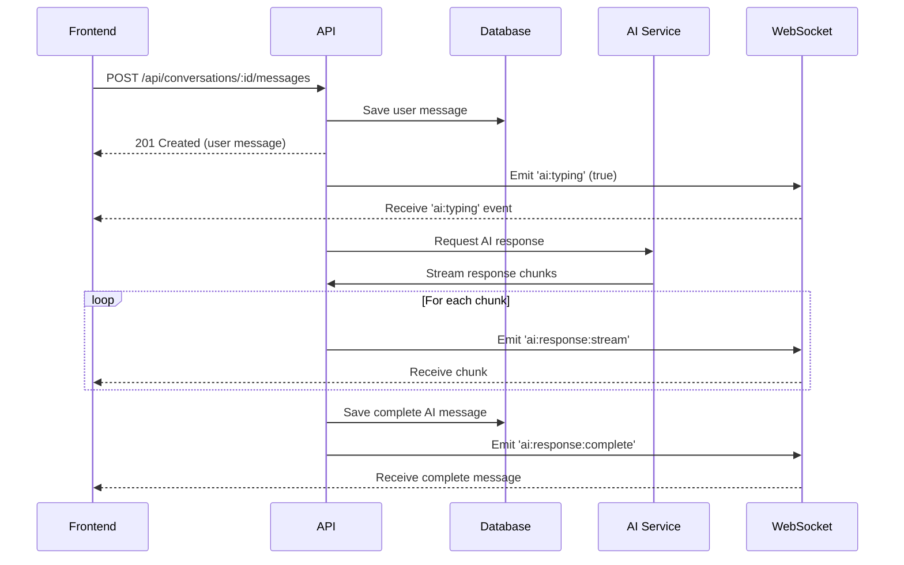

# ChatterBox 2.0 - DTOs e Contratos de API

Este documento define todos os contratos de API, DTOs (Data Transfer Objects), schemas e eventos WebSocket para facilitar a integração entre o backend (NestJS) e o frontend (React).

---

## 📋 Índice

1. [Modelos de Dados (MongoDB)](#modelos-de-dados-mongodb)
2. [DTOs de Request](#dtos-de-request)
3. [DTOs de Response](#dtos-de-response)
4. [Endpoints REST API](#endpoints-rest-api)
5. [Eventos WebSocket](#eventos-websocket)
6. [Tipos TypeScript Compartilhados](#tipos-typescript-compartilhados)
7. [Validações](#validações)

---

## 🗄️ Modelos de Dados (MongoDB)

### Conversation Schema

```typescript
{
  _id: ObjectId,
  title: string,                    // Título gerado automaticamente ou baseado na primeira mensagem
  createdAt: Date,
  updatedAt: Date,
  messageCount: number,             // Contador de mensagens
  status: 'active' | 'archived'     // Status da conversa
}
```

### Message Schema

```typescript
{
  _id: ObjectId,
  conversationId: ObjectId,         // Referência à conversa
  role: 'user' | 'assistant',       // Quem enviou a mensagem
  content: string,                  // Conteúdo da mensagem
  timestamp: Date,
  metadata: {
    model?: string,                 // Modelo de IA usado (ex: "gemini-pro")
    tokensUsed?: number,            // Tokens consumidos (se aplicável)
    processingTime?: number         // Tempo de processamento em ms
  }
}
```

**Índices MongoDB:**
```javascript
// Messages collection
{ conversationId: 1, timestamp: 1 }  // Para buscar mensagens de uma conversa ordenadas

// Conversations collection
{ updatedAt: -1 }                    // Para listar conversas mais recentes
```

---

## 📤 DTOs de Request

### CreateConversationDto

```typescript
// POST /api/conversations
interface CreateConversationDto {
  title?: string;              // Opcional: título customizado
  initialMessage?: string;     // Opcional: primeira mensagem do usuário
}
```

**Validações:**
- `title`: opcional, string, max 200 caracteres
- `initialMessage`: opcional, string, min 1, max 5000 caracteres

**Exemplo:**
```json
{
  "initialMessage": "Olá! Me fale sobre o planeta Terra."
}
```

---

### SendMessageDto

```typescript
// POST /api/conversations/:conversationId/messages
interface SendMessageDto {
  content: string;             // Conteúdo da mensagem do usuário
}
```

**Validações:**
- `content`: obrigatório, string, min 1, max 5000 caracteres, não pode ser apenas espaços em branco

**Exemplo:**
```json
{
  "content": "Por que você acha isso?"
}
```

---

## 📥 DTOs de Response

### ConversationResponseDto

```typescript
interface ConversationResponseDto {
  id: string;
  title: string;
  createdAt: string;           // ISO 8601 format
  updatedAt: string;           // ISO 8601 format
  messageCount: number;
  status: 'active' | 'archived';
  lastMessage?: MessageResponseDto;  // Última mensagem (opcional)
}
```

**Exemplo:**
```json
{
  "id": "6501234567890abcdef12345",
  "title": "Conversa sobre a Terra",
  "createdAt": "2025-11-13T14:30:00.000Z",
  "updatedAt": "2025-11-13T14:35:22.000Z",
  "messageCount": 8,
  "status": "active",
  "lastMessage": {
    "id": "6501234567890abcdef12346",
    "conversationId": "6501234567890abcdef12345",
    "role": "assistant",
    "content": "Você já parou para pensar nas evidências?",
    "timestamp": "2025-11-13T14:35:22.000Z"
  }
}
```

---

### MessageResponseDto

```typescript
interface MessageResponseDto {
  id: string;
  conversationId: string;
  role: 'user' | 'assistant';
  content: string;
  timestamp: string;           // ISO 8601 format
  metadata?: {
    model?: string;
    tokensUsed?: number;
    processingTime?: number;
  };
}
```

**Exemplo:**
```json
{
  "id": "6501234567890abcdef12347",
  "conversationId": "6501234567890abcdef12345",
  "role": "assistant",
  "content": "A Terra plana é uma realidade que muitos desconhecem...",
  "timestamp": "2025-11-13T14:35:25.000Z",
  "metadata": {
    "model": "gemini-pro",
    "tokensUsed": 150,
    "processingTime": 1250
  }
}
```

---

### PaginatedMessagesResponseDto

```typescript
interface PaginatedMessagesResponseDto {
  messages: MessageResponseDto[];
  pagination: {
    total: number;
    page: number;
    limit: number;
    hasNextPage: boolean;
    hasPreviousPage: boolean;
  };
}
```

**Exemplo:**
```json
{
  "messages": [
    {
      "id": "650...",
      "conversationId": "650...",
      "role": "user",
      "content": "Olá!",
      "timestamp": "2025-11-13T14:30:00.000Z"
    }
  ],
  "pagination": {
    "total": 8,
    "page": 1,
    "limit": 20,
    "hasNextPage": false,
    "hasPreviousPage": false
  }
}
```

---

### ErrorResponseDto

```typescript
interface ErrorResponseDto {
  statusCode: number;
  message: string | string[];
  error: string;
  timestamp: string;
  path: string;
}
```

**Exemplo:**
```json
{
  "statusCode": 400,
  "message": ["content must be a string", "content should not be empty"],
  "error": "Bad Request",
  "timestamp": "2025-11-13T14:35:30.000Z",
  "path": "/api/conversations/123/messages"
}
```

---

## 🔌 Endpoints REST API

### 1. Criar Nova Conversa

**Endpoint:** `POST /api/conversations`

**Request Body:**
```typescript
CreateConversationDto
```

**Response:** `201 Created`
```typescript
ConversationResponseDto
```

**Erros:**
- `400 Bad Request` - Validação falhou
- `500 Internal Server Error` - Erro no servidor

---

### 2. Listar Todas as Conversas

**Endpoint:** `GET /api/conversations`

**Query Parameters:**
- `page` (opcional): número da página (default: 1)
- `limit` (opcional): itens por página (default: 20, max: 100)
- `status` (opcional): filtrar por status ('active' | 'archived')

**Response:** `200 OK`
```typescript
{
  conversations: ConversationResponseDto[];
  pagination: {
    total: number;
    page: number;
    limit: number;
    hasNextPage: boolean;
    hasPreviousPage: boolean;
  };
}
```

**Exemplo URL:**
```
GET /api/conversations?page=1&limit=20&status=active
```

---

### 3. Buscar Conversa por ID

**Endpoint:** `GET /api/conversations/:id`

**Path Parameters:**
- `id`: ID da conversa (MongoDB ObjectId)

**Response:** `200 OK`
```typescript
ConversationResponseDto
```

**Erros:**
- `404 Not Found` - Conversa não encontrada
- `400 Bad Request` - ID inválido

---

### 4. Buscar Mensagens de uma Conversa

**Endpoint:** `GET /api/conversations/:id/messages`

**Path Parameters:**
- `id`: ID da conversa

**Query Parameters:**
- `page` (opcional): número da página (default: 1)
- `limit` (opcional): itens por página (default: 50, max: 100)

**Response:** `200 OK`
```typescript
PaginatedMessagesResponseDto
```

**Erros:**
- `404 Not Found` - Conversa não encontrada
- `400 Bad Request` - Parâmetros inválidos

---

### 5. Enviar Mensagem (Criar Mensagem do Usuário)

**Endpoint:** `POST /api/conversations/:id/messages`

**Path Parameters:**
- `id`: ID da conversa

**Request Body:**
```typescript
SendMessageDto
```

**Response:** `201 Created`
```typescript
{
  userMessage: MessageResponseDto;      // Mensagem do usuário criada
  conversationId: string;
}
```

**Comportamento:**
1. Salva a mensagem do usuário no banco
2. Retorna imediatamente a mensagem do usuário
3. Processa a resposta da IA **assincronamente** via WebSocket
4. Envia a resposta da IA via WebSocket quando pronta

**Erros:**
- `404 Not Found` - Conversa não encontrada
- `400 Bad Request` - Validação falhou
- `500 Internal Server Error` - Erro ao processar

---

### 6. Deletar Conversa

**Endpoint:** `DELETE /api/conversations/:id`

**Path Parameters:**
- `id`: ID da conversa

**Response:** `204 No Content`

**Erros:**
- `404 Not Found` - Conversa não encontrada
- `400 Bad Request` - ID inválido

---

## 🔄 Eventos WebSocket

### Namespace: `/chat`

**URL de Conexão:** `ws://localhost:3000/chat` (dev) ou `wss://api.domain.com/chat` (prod)

---

### Cliente → Servidor

#### 1. `join:conversation`

Entrar em uma sala de conversa para receber atualizações em tempo real.

**Payload:**
```typescript
interface JoinConversationPayload {
  conversationId: string;
}
```

**Exemplo:**
```javascript
socket.emit('join:conversation', { conversationId: '6501234567890abcdef12345' });
```

**Resposta do servidor:**
```typescript
// Evento: 'joined:conversation'
{
  conversationId: string;
  message: string;
}
```

---

#### 2. `leave:conversation`

Sair de uma sala de conversa.

**Payload:**
```typescript
interface LeaveConversationPayload {
  conversationId: string;
}
```

**Exemplo:**
```javascript
socket.emit('leave:conversation', { conversationId: '6501234567890abcdef12345' });
```

---

### Servidor → Cliente

#### 1. `ai:typing`

Indica que a IA está processando uma resposta (typing indicator).

**Payload:**
```typescript
interface AITypingPayload {
  conversationId: string;
  isTyping: boolean;
}
```

**Exemplo:**
```json
{
  "conversationId": "6501234567890abcdef12345",
  "isTyping": true
}
```

---

#### 2. `ai:response:stream`

Stream da resposta da IA (palavra por palavra ou chunk por chunk).

**Payload:**
```typescript
interface AIResponseStreamPayload {
  conversationId: string;
  messageId: string;          // ID da mensagem sendo criada
  chunk: string;              // Pedaço do texto
  isComplete: boolean;        // true quando terminar
}
```

**Exemplo (chunks sequenciais):**
```json
// Chunk 1
{
  "conversationId": "6501234567890abcdef12345",
  "messageId": "6501234567890abcdef12350",
  "chunk": "Você ",
  "isComplete": false
}

// Chunk 2
{
  "conversationId": "6501234567890abcdef12345",
  "messageId": "6501234567890abcdef12350",
  "chunk": "já parou ",
  "isComplete": false
}

// Chunk final
{
  "conversationId": "6501234567890abcdef12345",
  "messageId": "6501234567890abcdef12350",
  "chunk": "para pensar?",
  "isComplete": true
}
```

---

#### 3. `ai:response:complete`

Resposta completa da IA quando o streaming termina.

**Payload:**
```typescript
interface AIResponseCompletePayload {
  conversationId: string;
  message: MessageResponseDto;  // Mensagem completa da IA
}
```

**Exemplo:**
```json
{
  "conversationId": "6501234567890abcdef12345",
  "message": {
    "id": "6501234567890abcdef12350",
    "conversationId": "6501234567890abcdef12345",
    "role": "assistant",
    "content": "Você já parou para pensar nas evidências?",
    "timestamp": "2025-11-13T14:35:30.000Z",
    "metadata": {
      "model": "gemini-pro",
      "tokensUsed": 120,
      "processingTime": 1500
    }
  }
}
```

---

#### 4. `error`

Erro durante o processamento.

**Payload:**
```typescript
interface ErrorPayload {
  conversationId?: string;
  error: string;
  message: string;
}
```

**Exemplo:**
```json
{
  "conversationId": "6501234567890abcdef12345",
  "error": "AI_SERVICE_ERROR",
  "message": "Falha ao processar resposta da IA. Tente novamente."
}
```

---

## 🎯 Tipos TypeScript Compartilhados

Estes tipos podem ser compartilhados entre backend e frontend (criar um pacote `@chatterbox/shared` ou duplicar).

### Enums

```typescript
export enum MessageRole {
  USER = 'user',
  ASSISTANT = 'assistant'
}

export enum ConversationStatus {
  ACTIVE = 'active',
  ARCHIVED = 'archived'
}

export enum WebSocketEvent {
  // Client → Server
  JOIN_CONVERSATION = 'join:conversation',
  LEAVE_CONVERSATION = 'leave:conversation',

  // Server → Client
  JOINED_CONVERSATION = 'joined:conversation',
  AI_TYPING = 'ai:typing',
  AI_RESPONSE_STREAM = 'ai:response:stream',
  AI_RESPONSE_COMPLETE = 'ai:response:complete',
  ERROR = 'error'
}
```

---

### Interfaces Completas

```typescript
// Message
export interface IMessage {
  id: string;
  conversationId: string;
  role: MessageRole;
  content: string;
  timestamp: string;
  metadata?: {
    model?: string;
    tokensUsed?: number;
    processingTime?: number;
  };
}

// Conversation
export interface IConversation {
  id: string;
  title: string;
  createdAt: string;
  updatedAt: string;
  messageCount: number;
  status: ConversationStatus;
  lastMessage?: IMessage;
}

// Pagination
export interface IPagination {
  total: number;
  page: number;
  limit: number;
  hasNextPage: boolean;
  hasPreviousPage: boolean;
}
```

---

## ✅ Validações

### Regras de Validação (Backend com class-validator)

```typescript
// CreateConversationDto
class CreateConversationDto {
  @IsOptional()
  @IsString()
  @MaxLength(200)
  title?: string;

  @IsOptional()
  @IsString()
  @MinLength(1)
  @MaxLength(5000)
  @Matches(/\S/, { message: 'Message cannot be only whitespace' })
  initialMessage?: string;
}

// SendMessageDto
class SendMessageDto {
  @IsNotEmpty()
  @IsString()
  @MinLength(1)
  @MaxLength(5000)
  @Matches(/\S/, { message: 'Content cannot be only whitespace' })
  content: string;
}
```

---

### Códigos de Erro Customizados

```typescript
export enum ErrorCode {
  CONVERSATION_NOT_FOUND = 'CONVERSATION_NOT_FOUND',
  MESSAGE_NOT_FOUND = 'MESSAGE_NOT_FOUND',
  INVALID_CONVERSATION_ID = 'INVALID_CONVERSATION_ID',
  AI_SERVICE_ERROR = 'AI_SERVICE_ERROR',
  VALIDATION_ERROR = 'VALIDATION_ERROR',
  DATABASE_ERROR = 'DATABASE_ERROR'
}
```

---

## 📊 Fluxo de Integração Completo

### Fluxo: Usuário Envia Mensagem



---

## 🧪 Exemplos de Uso no Frontend

### Inicializar Socket.io

```typescript
import { io, Socket } from 'socket.io-client';

const socket: Socket = io('http://localhost:3000/chat', {
  transports: ['websocket'],
  autoConnect: false
});

socket.connect();
```

---

### Entrar em uma Conversa

```typescript
socket.emit('join:conversation', {
  conversationId: '6501234567890abcdef12345'
});

socket.on('joined:conversation', (data) => {
  console.log('Joined:', data.message);
});
```

---

### Escutar Eventos da IA

```typescript
// Typing indicator
socket.on('ai:typing', (data) => {
  if (data.isTyping) {
    showTypingIndicator();
  } else {
    hideTypingIndicator();
  }
});

// Streaming response
let streamedMessage = '';
socket.on('ai:response:stream', (data) => {
  streamedMessage += data.chunk;
  updateMessageInUI(data.messageId, streamedMessage);

  if (data.isComplete) {
    streamedMessage = '';
  }
});

// Complete response
socket.on('ai:response:complete', (data) => {
  addMessageToChat(data.message);
});

// Errors
socket.on('error', (data) => {
  showErrorNotification(data.message);
});
```

---

### Enviar Mensagem

```typescript
async function sendMessage(conversationId: string, content: string) {
  try {
    const response = await fetch(
      `http://localhost:3000/api/conversations/${conversationId}/messages`,
      {
        method: 'POST',
        headers: { 'Content-Type': 'application/json' },
        body: JSON.stringify({ content })
      }
    );

    if (!response.ok) throw new Error('Failed to send message');

    const data = await response.json();
    addMessageToChat(data.userMessage);

    // AI response will come via WebSocket
  } catch (error) {
    console.error('Error sending message:', error);
  }
}
```

---

## 🔐 Considerações de Segurança

1. **Validação de Input:** Todos os inputs devem ser validados no backend
2. **Rate Limiting:** Implementar rate limiting nos endpoints (ex: 10 msgs/min por IP)
3. **Content Sanitization:** Sanitizar conteúdo antes de armazenar (evitar XSS)
4. **WebSocket Authentication:** (Para futuro) Implementar autenticação de socket
5. **CORS:** Configurar CORS apropriadamente no backend

---

## 📝 Notas de Implementação

### Backend (NestJS)

1. Usar `@nestjs/mongoose` para integração MongoDB
2. Usar `class-validator` e `class-transformer` para DTOs
3. Usar `@nestjs/platform-socket.io` para WebSocket
4. Usar `@nestjs/swagger` para documentação automática
5. Criar interceptors para transformar ObjectId → string

### Frontend (React)

1. Usar `axios` ou `fetch` para chamadas REST
2. Usar `socket.io-client` para WebSocket
3. Criar custom hooks: `useConversation`, `useMessages`, `useSocket`
4. Implementar estado global (Context API ou Zustand) para mensagens em tempo real

---

## 🎉 Conclusão

Este documento serve como **fonte única de verdade** para a integração entre backend e frontend do ChatterBox 2.0. Todos os desenvolvedores devem seguir estes contratos para garantir compatibilidade total entre os serviços.

**Versão:** 1.0
**Última atualização:** 2025-11-13
