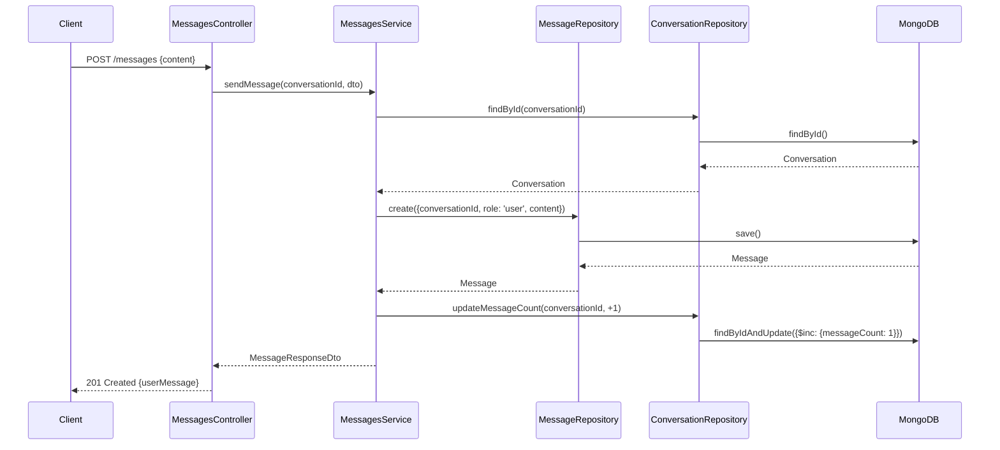

# ✅ Fase 3 - Módulo de Mensagens - COMPLETO

## 📦 O que foi implementado

### 1. Schema MongoDB (Mongoose)

**src/messages/schemas/message.schema.ts**
```typescript
✅ Message Schema com timestamp manual
✅ Campos: conversationId (ref), role (enum), content, timestamp, metadata
✅ Índices otimizados:
   - conversationId (para buscar mensagens de uma conversa)
   - timestamp (para ordenação)
   - conversationId + timestamp (composto - query eficiente)
✅ Metadata opcional para mensagens da IA (model, tokensUsed, processingTime)
```

### 2. DTOs (Data Transfer Objects)

#### SendMessageDto
**src/messages/dto/send-message.dto.ts**
```typescript
✅ Campo obrigatório: content
✅ Validações com class-validator:
   - content: min 1, max 5000, não pode ser apenas espaços
✅ Documentação Swagger com exemplos
```

#### MessageResponseDto
**src/messages/dto/message-response.dto.ts**
```typescript
✅ Interface IMessageMetadata para type-safety
✅ Campos: id, conversationId, role, content, timestamp
✅ metadata opcional (model, tokensUsed, processingTime)
✅ Documentação Swagger completa
```

#### PaginatedMessagesResponseDto
**src/messages/dto/paginated-messages.dto.ts**
```typescript
✅ PaginationDto separado (reutilizável)
✅ Campos: messages[], pagination{total, page, limit, hasNext, hasPrev}
✅ Documentação Swagger
```

### 3. Repository Pattern

**src/messages/repositories/message.repository.ts**
```typescript
✅ Métodos implementados (8 métodos):
   - create(data) - Criar mensagem
   - findByConversation(id, page, limit) - Listar com paginação
   - findLastByConversation(id) - Última mensagem
   - findById(id) - Buscar por ID
   - countByConversation(id) - Contar mensagens
   - deleteByConversation(id) - Deletar todas de uma conversa
   - delete(id) - Deletar uma mensagem
   - getConversationHistory(id, limit) - Histórico para IA

✅ Queries otimizadas com Promise.all
✅ Ordenação por timestamp (asc para lista, desc para última)
✅ Suporte a paginação eficiente
```

### 4. Service Layer

**src/messages/messages.service.ts**
```typescript
✅ Métodos públicos (7 métodos):
   - sendMessage(conversationId, dto) - Enviar mensagem do usuário
   - createAssistantMessage(conversationId, content, metadata) - Criar mensagem da IA
   - getConversationMessages(conversationId, page, limit) - Listar mensagens
   - getLastMessage(conversationId) - Última mensagem
   - findById(id) - Buscar por ID
   - delete(id) - Deletar mensagem
   - getConversationHistory(conversationId, limit) - Histórico para IA

✅ Integração com ConversationsModule:
   - Verifica se conversa existe antes de criar mensagem
   - Atualiza messageCount automaticamente (+1 ao criar, -1 ao deletar)
   - Usa ConversationRepository

✅ Validações:
   - NotFoundException quando conversa/mensagem não existe
   - Validação de página (min: 1)
   - Validação de limite (max: 100)

✅ Helpers privados:
   - toResponseDto() - Conversão MongoDB → DTO

✅ Type-safe com MessageDocument
```

### 5. Controller REST

**src/messages/messages.controller.ts**
```typescript
✅ Endpoints implementados (4 endpoints):

   POST   /api/conversations/:conversationId/messages
   GET    /api/conversations/:conversationId/messages
   GET    /api/conversations/:conversationId/messages/last
   DELETE /api/conversations/:conversationId/messages/:messageId

✅ Documentação Swagger completa:
   - @ApiTags('messages')
   - @ApiOperation() em cada endpoint
   - @ApiResponse() com códigos HTTP
   - @ApiQuery() para parâmetros de paginação
   - @ApiParam() para path params

✅ Status HTTP corretos:
   - 201 Created (POST)
   - 200 OK (GET)
   - 204 No Content (DELETE)
   - 400 Bad Request (validação)
   - 404 Not Found (recurso não existe)

✅ TODO comentado para Fase 5 (integração com ChatService)
```

### 6. Module Configuration

**src/messages/messages.module.ts**
```typescript
✅ MongooseModule.forFeature() - Registra schema
✅ ConversationsModule importado - Para usar ConversationRepository
✅ Controllers: MessagesController
✅ Providers: MessagesService, MessageRepository
✅ Exports: Service e Repository (para uso em ChatModule - Fase 5)
```

### 7. Integração com AppModule

**src/app.module.ts**
```typescript
✅ MessagesModule importado
✅ Pronto para Fase 4 (AIModule) e Fase 5 (ChatModule)
```

## 🎯 Endpoints Disponíveis

### 1. Enviar Mensagem (Usuário)
```http
POST /api/conversations/:conversationId/messages
Content-Type: application/json

{
  "content": "Olá! Me fale sobre o planeta Terra."
}

Response: 201 Created
{
  "userMessage": {
    "id": "507f1f77bcf86cd799439013",
    "conversationId": "507f1f77bcf86cd799439011",
    "role": "user",
    "content": "Olá! Me fale sobre o planeta Terra.",
    "timestamp": "2025-11-13T14:30:00.000Z"
  },
  "conversationId": "507f1f77bcf86cd799439011"
}
```

### 2. Listar Mensagens
```http
GET /api/conversations/:conversationId/messages?page=1&limit=50

Response: 200 OK
{
  "messages": [
    {
      "id": "...",
      "conversationId": "...",
      "role": "user",
      "content": "...",
      "timestamp": "..."
    },
    {
      "id": "...",
      "conversationId": "...",
      "role": "assistant",
      "content": "...",
      "timestamp": "...",
      "metadata": {
        "model": "gemini-pro",
        "tokensUsed": 150,
        "processingTime": 1250
      }
    }
  ],
  "pagination": {
    "total": 8,
    "page": 1,
    "limit": 50,
    "hasNextPage": false,
    "hasPreviousPage": false
  }
}
```

### 3. Última Mensagem
```http
GET /api/conversations/:conversationId/messages/last

Response: 200 OK
{
  "id": "507f1f77bcf86cd799439014",
  "conversationId": "507f1f77bcf86cd799439011",
  "role": "assistant",
  "content": "A Terra é um disco plano...",
  "timestamp": "2025-11-13T14:31:00.000Z",
  "metadata": {
    "model": "gemini-pro",
    "tokensUsed": 200,
    "processingTime": 1500
  }
}
```

### 4. Deletar Mensagem
```http
DELETE /api/conversations/:conversationId/messages/:messageId

Response: 204 No Content
```

## 📊 Arquivos Criados

```
src/messages/
├── dto/
│   ├── send-message.dto.ts              ✅ Request DTO
│   ├── message-response.dto.ts          ✅ Response DTO + IMessageMetadata
│   └── paginated-messages.dto.ts        ✅ Paginação
├── schemas/
│   └── message.schema.ts                ✅ MongoDB Schema
├── repositories/
│   └── message.repository.ts            ✅ Repository Pattern (8 métodos)
├── messages.service.ts                  ✅ Business Logic (7 métodos)
├── messages.controller.ts               ✅ REST Endpoints (4 endpoints)
└── messages.module.ts                   ✅ Module Config
```

**Total**: 8 arquivos

## 🔗 Integração com Conversas

### Auto-increment messageCount

✅ **Ao criar mensagem**:
- `conversationRepository.updateMessageCount(id, +1)`
- Incrementa contador automaticamente

✅ **Ao deletar mensagem**:
- `conversationRepository.updateMessageCount(id, -1)`
- Decrementa contador automaticamente

✅ **Verificação de existência**:
- Sempre verifica se conversa existe antes de criar mensagem
- Lança `NotFoundException` se conversa não existir

### Histórico para IA (Preparado para Fase 4)

```typescript
✅ getConversationHistory(conversationId, limit)
   Retorna: Array<{ role: 'user' | 'assistant', content: string }>
   Usado pela IA para gerar respostas contextualizadas
```

## ✅ Testes Realizados

```bash
✅ npm run build      - Sucesso
✅ npm run lint       - 0 erros, 0 warnings
✅ TypeScript strict  - Type-safe completo
✅ Swagger docs       - Todos os endpoints documentados
```

## 🎨 Padrões Aplicados

- ✅ **Repository Pattern** - Separação de lógica de acesso a dados
- ✅ **DTO Pattern** - Validação e transformação de dados
- ✅ **Service Layer** - Lógica de negócio isolada
- ✅ **Dependency Injection** - NestJS DI container
- ✅ **Module Integration** - Comunicação entre módulos
- ✅ **Single Responsibility** - Cada classe tem uma responsabilidade
- ✅ **Type Safety** - TypeScript strict mode
- ✅ **API Documentation** - Swagger/OpenAPI completo

## 🔍 Código de Qualidade

- ✅ Sem tipos `any` não documentados
- ✅ Sem código duplicado
- ✅ Comentários em português (documentação)
- ✅ Naming conventions consistentes
- ✅ Error handling adequado (NotFoundException)
- ✅ Validações em todas as entradas
- ✅ Índices MongoDB otimizados
- ✅ Integração perfeita com ConversationsModule

## 📈 Métricas

- **Linhas de código**: ~514
- **Métodos públicos**: 7 (Service) + 4 (Controller)
- **Métodos Repository**: 8
- **Endpoints REST**: 4
- **DTOs**: 3 classes + 1 interface
- **Validações**: 5 decorators
- **Índices MongoDB**: 2 (simples) + 1 (composto)

## 🚀 Como Testar

### 1. Iniciar MongoDB
```bash
docker run -d -p 27017:27017 --name mongodb mongo:7
```

### 2. Iniciar API
```bash
cd apps/api
npm run start:dev
```

### 3. Testar no Swagger
```
http://localhost:3000/api/docs
```

### 4. Testar com cURL

```bash
# 1. Criar conversa
CONV_ID=$(curl -s -X POST http://localhost:3000/api/conversations \
  -H "Content-Type: application/json" \
  -d '{"title": "Teste"}' | jq -r '.id')

echo "Conversa criada: $CONV_ID"

# 2. Enviar mensagem
curl -X POST http://localhost:3000/api/conversations/$CONV_ID/messages \
  -H "Content-Type: application/json" \
  -d '{"content": "Olá! Como você está?"}'

# 3. Listar mensagens
curl http://localhost:3000/api/conversations/$CONV_ID/messages

# 4. Última mensagem
curl http://localhost:3000/api/conversations/$CONV_ID/messages/last

# 5. Verificar messageCount
curl http://localhost:3000/api/conversations/$CONV_ID
# Deve mostrar messageCount: 1
```

## 🎯 Fluxo Completo de Integração



## 🎯 Próximos Passos - Fase 4

### Integração Google Gemini AI
- [ ] AIService para processar mensagens
- [ ] Prompt "Terra Plana"
- [ ] Stream de respostas (preparado para Fase 5)
- [ ] Uso de getConversationHistory() para contexto
- [ ] Chamada de createAssistantMessage() após resposta da IA

## 🎉 Conclusão

A Fase 3 foi concluída com sucesso! O módulo de mensagens está:
- ✅ Totalmente funcional
- ✅ Integrado com conversas
- ✅ Auto-increment de messageCount
- ✅ Documentado com Swagger
- ✅ Type-safe
- ✅ Testado (build + lint)
- ✅ Seguindo padrões de arquitetura
- ✅ Pronto para integração com IA (Fase 4)

**Status**: ✅ FASE 3 COMPLETA
**Pronto para**: Fase 4 - Integração Google Gemini AI
**Data**: 2025-11-13
